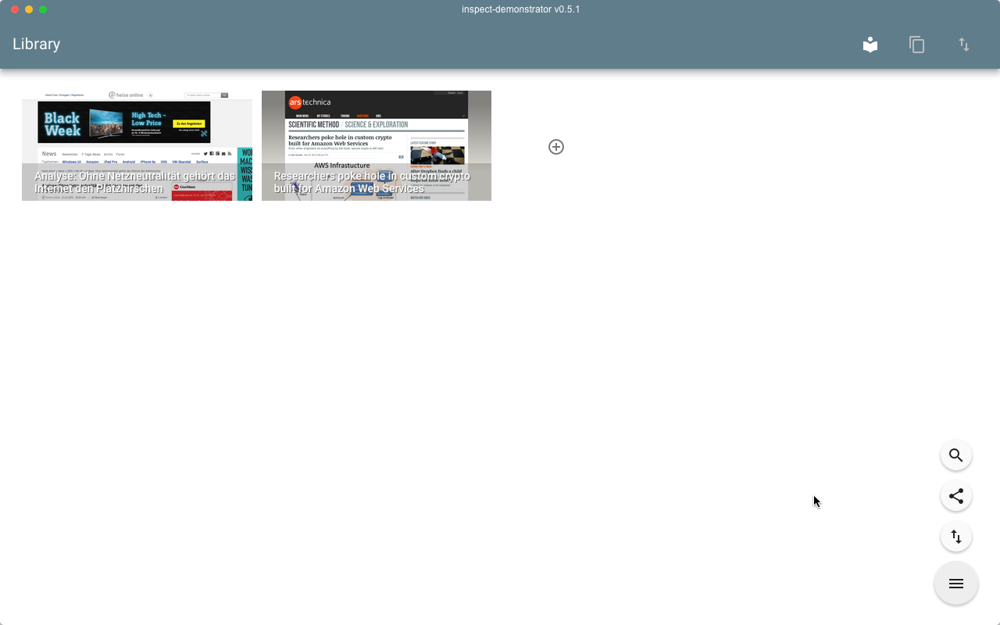

# inspect-demonstrator
A demonstrator for the funded INSPECT project

## Included modules
* Electron
* Angular
* Angular Material Design
* Angular UI Router
* PouchDB + Plugins (geo-spatial, MongoDB-style query language and full-text search engine support)

## Getting started
* install latest node.js from [here](http://www.nodejs.org)
* install Git from [here](https://git-scm.com/)
* clone git repository (```git clone https://gitlab.com/appelgriebsch/inspect-demonstrator.git```)
* define 2 new system environment variables for proxy use ```HTTPS_PROXY=http://proxy.wincor-nixdorf.com:81``` and ```HTTP_PROXY=http://proxy.wincor-nixdorf.com:81``` and restart the PC
* open terminal and run ```npm install``` to install dependencies
* start application in debug by executing ```npm start``` in terminal

## Screenshot



## Build Distributable Packages

**PLEASE NOTE: you will need a virtual machine with the actual operating system and development tools installed to build the native packages for it**

* on OS X (10.9+): creates application bundle and distributable disk image (x64 only)

  ```bash
  grunt osx
  ```
* on Windows (7+): creates application .exe and distributable setup.exe (x86 only)

  ```bash
  grunt win
  ```
* on Linux (Ubuntu/Fedora): creates application and distributable packages for deb-style and rpm-style distributions (x64 only)

  ```bash
  grunt linux
  ```
